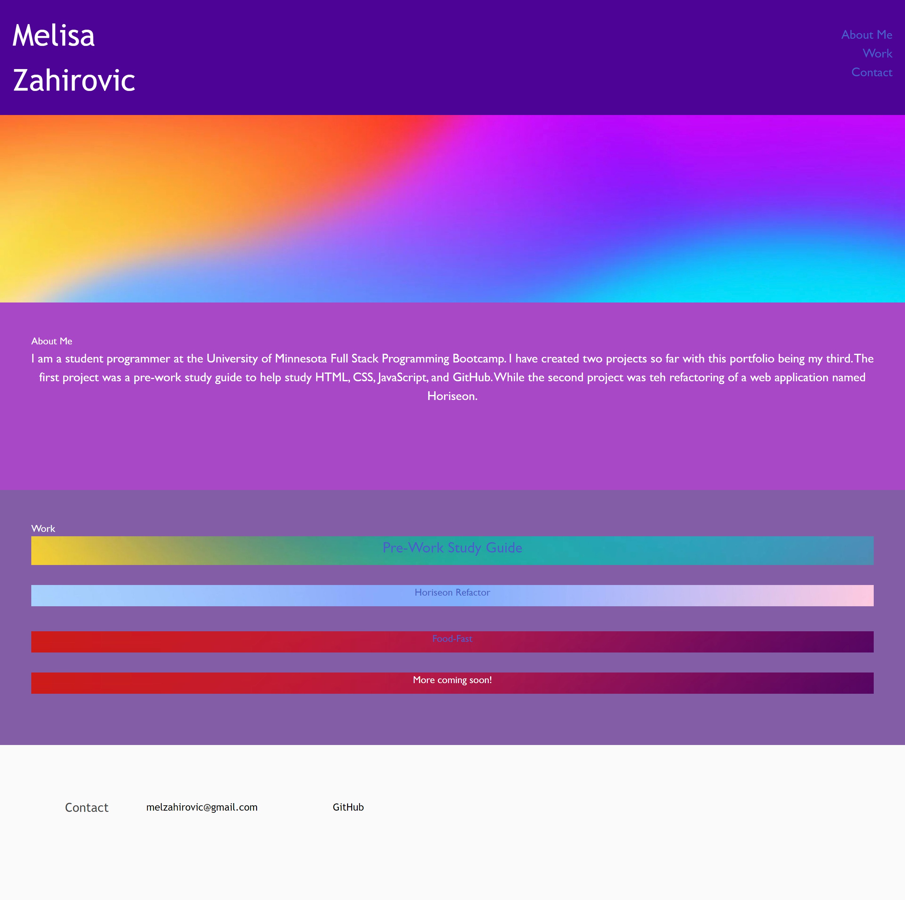

# Portfolio

## Description

I created a portfolio using HTML and CSS for potential employers. It utilizes HTML and CSS, while applying Flexbox. 

## Installation

N/A

## Usage 

This website displays the projects I have created in my University of Minnesota Full Stack Program. While also displaying my contact information and a simple bio. 

#### The work done can be found the GitHub repository [zahirovic/Portfolio](https://github.com/zahirovic/Portfolio)
- The actual product can be found **[here](https://zahirovic.github.io/Portfolio/)** and should look along the lines of this depending on device screen size:

## Credits

- [Markdown Tutorial](https://www.markdowntutorial.com/) for help on basic markdown 

## Features

- HTML alt image text
- HTML/CSS alt title image text 
- Flexbox

